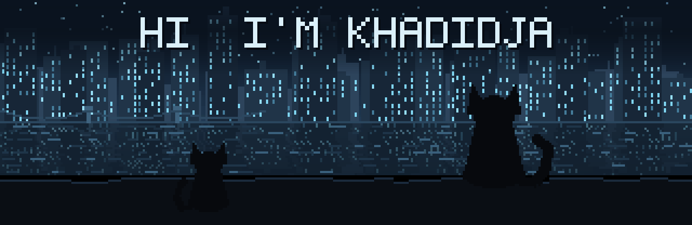
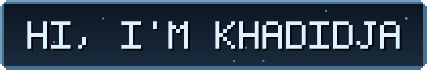
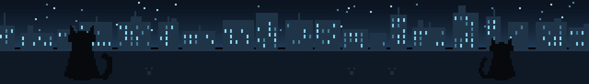

<div align="center">



<br/>



<br/><br/>

<a href="https://github.com/khadidja90">
  
</a>


<a href="https://www.linkedin.com/in/khadidja-djaoud-2926273b6/"></a>
<a href="mailto:dkjaoudkhadidja22@gmail.com"></a>
<a href="https://github.com/khadidja90"></a>

</div>

<br/>

<h3 align="center">🐈‍⬛ About Me</h3>

```js
const khadidja = {
    role: "Master's Student in Computer Science @ USTHB",
    interests: ["Backend Development", "Databases", "Computer Vision"],
    currentlyLearning: "Computer Vision",
    funFact: "I like turning class projects into things people can actually use"
};
```

<div align="center">

🔭 Building small-scale backend & mobile projects to sharpen real-world skills&nbsp; · &nbsp;🌱 Learning **Computer Vision**&nbsp; · &nbsp;👯 Open to collaborate on **backend / database / CV** projects

</div>

<br/>

<h3 align="center">🛠️ Tech Stack</h3>

<div align="center">


<br/><br/>


</div>

<p align="center"><sub><b>Also comfortable with:</b> Django REST Framework · SQL · OOP · Data Structures & Algorithms · DBMS Design</sub></p>

<br/>

<h3 align="center">📌 Featured Projects</h3>

<div align="center">

| Project | Description | Stack |
|---|---|---|
| 🕹️ [Mini Games](https://github.com/khadidja90) | A collection of small Python games built for fun and practice | `Python` |
| 🤳 [Mini Social Media App](https://github.com/khadidja90) | A lightweight social app with real-time features | `Kotlin` · `Firebase` |
| 🏨 [Booking Management System](https://github.com/khadidja90) | A system to manage reservations, rooms, and bookings | `Laravel` |

</div>

<br/>

<h3 align="center">📊 GitHub Stats</h3>

<div align="center">


<br/><br/>


</div>

<br/>



<p align="center"><sub><i>⭐️ From <a href="https://github.com/khadidja90">khadidja90</a> — thanks for stopping by, night owl.</i></sub></p>
